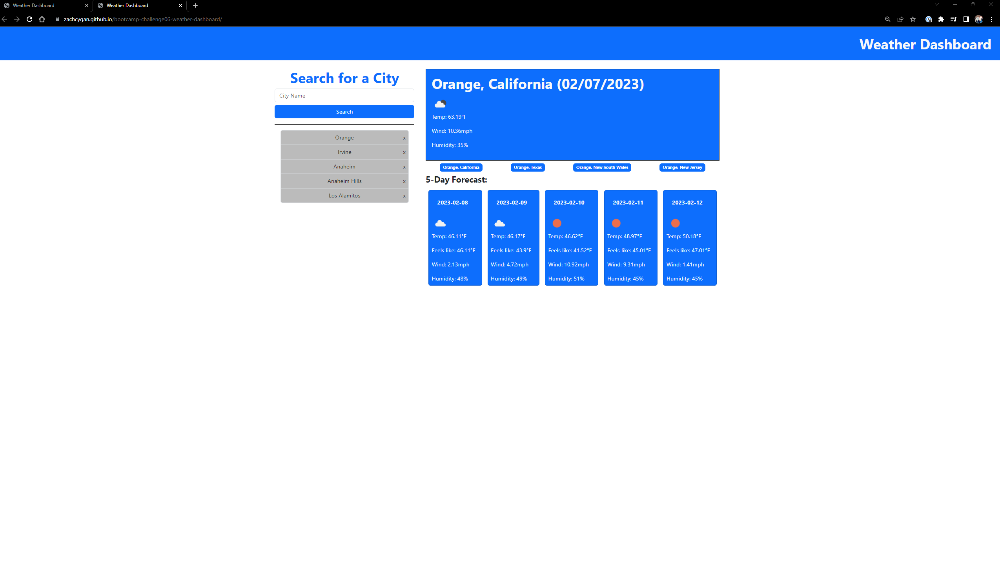
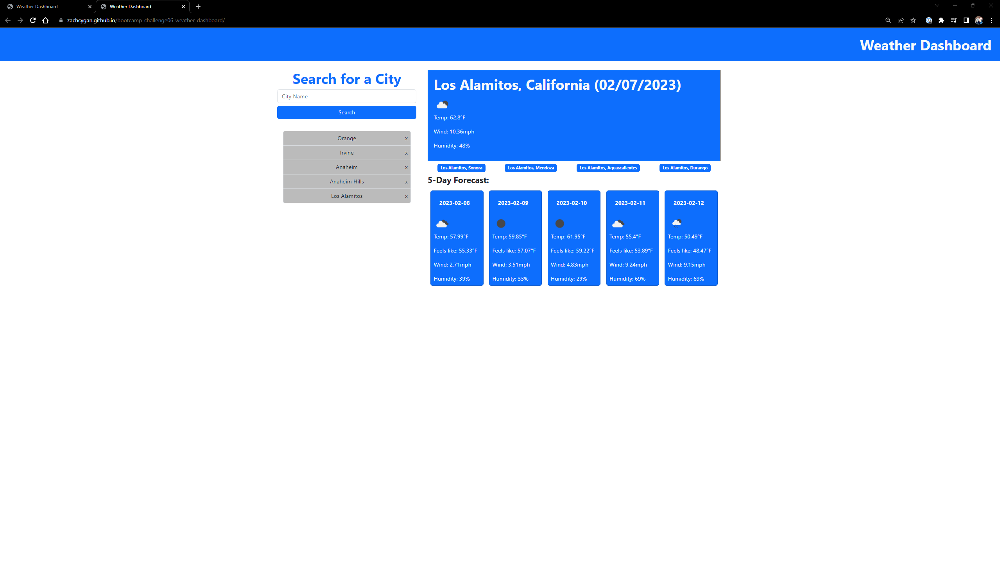

# <bootcamp-challenge06-Weather-Dashboard>

## Description

My motivation for this project is to make a weather dashboard to look find the current weather and a five day forecast. This project calls from the OpenWeatherMap api to grab the city coordinates and get the weather.   

## Installation

The webpage is available at https://zachcygan.github.io/weather-dashboard/. To view the source code within your browser, press F12 or right click the webpage and select "inspect" on windows. For MacOS,  press Command+Option+I or fn F12 (MacOS) to open Chrome DevTools. You can view any elements on the webpage or any of the styling by selecting the corresponding section in Chrome DevTools. 

## Instructions

To find the weather of a city, simply search the city in the search field. If the result is not what you are looking for, there are other suggestions under todays forecast for other cities with the same name, but are in a different city or region. Also, any searches
will be added to your local storage. You may search for from your local storage by clicking on them. Additionally, you can delete items from your local storage just by clicking the x on the side of the name.

## Screenshots

